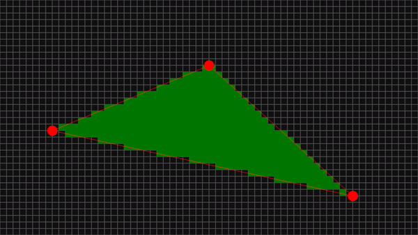

# Disasterisation

Small program to learn more about rasterisation and maybe vector graphics while I'm at it. 
Made with the help of [SDL2](https://www.libsdl.org/)

## Instructions

`LEFT CLICK` - Move selected point  
`RIGHT CLICK` - Add point/Delete selected point



### Compile/Build

```console
> build.bat
```

### Run

```console
> cd build
> raster.exe
```